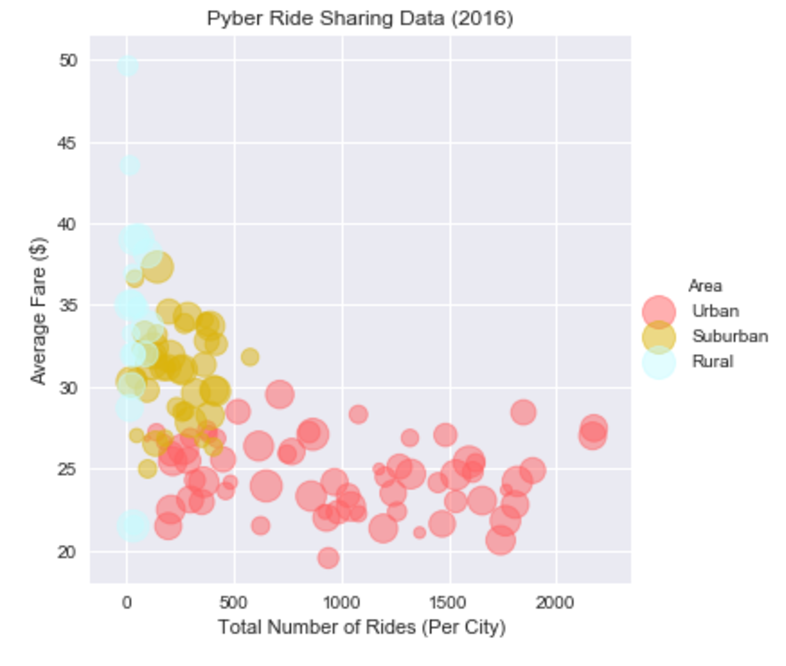
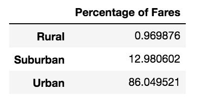
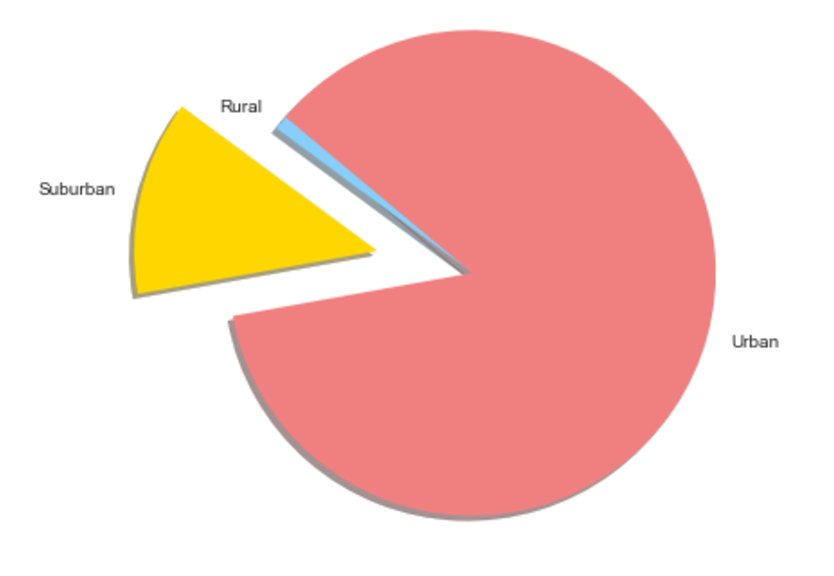

# Pyber:

## This project examines Uber data with bubble charts and pie charts to analyze:
-Average fare per city  

-Total number of drivers per city  

-Total number of rides per city  

-City Type (Urban, Suburban, Rural)  

-Percentage of total fares, rides, and drivers by city type  
  

## Libraries Used:
* Matplotlib.pyplot
* Seaborn
* NumPy
* Pandas

## Run With:
* Jupyter Notebook

  
# Documentation:  
<!---->
<!--  -->
<!--  -->
<!--  -->
<!--  -->
<!--  -->
  
  
  
  

